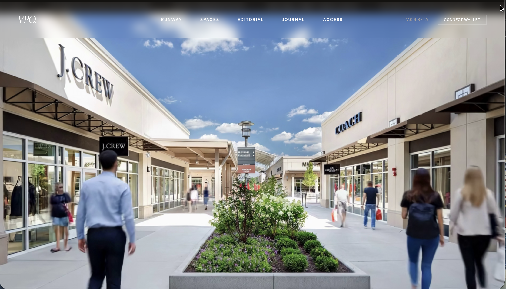

# VPO — Virtual Premium Outlets

**New features coming soon**

A navigable store demo is coming soon in the next version.

### Your friends. Your favourite stores. Considerably less airfare.

What if you went shopping today?

With your friend in New York. Your sister in Paris. That one friend in Dubai who calls everything “an investment piece.”

What if you could walk into a store together, explore its collections, try something on, and ask, “Be honest. Does this work?”

All without leaving your couch.

**That’s the world we’re building with VPO.**

*Imagine meeting your friends here. The commute is opening your browser.*

## Somewhere along the way, online shopping lost the shopping.

The wandering. The discovery. The friend who finds something you would never have picked yourself.

We got filters, grids, and 47 open tabs.

Convenient? Absolutely. A day out? Hardly.

VPO brings the experience of going shopping into a shared 3D world: real stores, their products, and people exploring them together.

Walk through the space. See what catches your eye. Take a detour. Find something you weren’t looking for.

**The internet made shopping accessible. We want to make it somewhere you actually want to go.**

## Same couch. Different city.

Your next shopping trip could start across town or across the world.

Step inside a store’s own 3D environment. Explore its layout, browse its collections, and get a sense of the place behind the products.

The entrance. The displays. The corner you almost walked past.

A store has a personality. It deserves more than a thumbnail.

## Bring your friends. Especially the opinionated ones.

Send an invitation. Meet inside. Shop together.

Catch up with a friend overseas while browsing the same collection. Show someone what you found. Help them choose. Accept absolutely no responsibility when they buy both.

VPO is being designed for the people you already love shopping with—and the distance that currently gets in the way.

**Different time zones. Same shopping trip.**

## A shopping street should have people in it.

See other shoppers exploring the world alongside you.

Friends arriving. People browsing. Characters passing through the same spaces.

That little sense that somewhere is alive.

Come for a quick look, make an evening of it with friends, or wander on your own. There’s room for all three.

## Dress yourself. Then dress yourself again.

Create and customise your character, then take your style into the world.

Explore collections, virtually try on pieces, and put together a look before adding your favourites to your cart.

Get a second opinion from a friend. Politely ignore it.

When you’re ready, head to the checkout counter and complete your purchase.

**Browse, try on, add to cart, check out—all part of the same visit.**

## Have a store? You already have the setting.

You’ve spent time making your store feel like yours.

Let’s bring that online.

Our vision for retailers starts with something familiar: **shoot a video of your store.**

That footage becomes the starting point for bringing your space into VPO. Add your product inventory, and give shoppers a place they can explore from anywhere.

New product?

**Take a photo. Add it to your inventory. Give it a place in your virtual store.**

The ambition is to make keeping your virtual shop current feel like running your shop—not taking on a second career in 3D design.

Your space. Your collections. A much bigger neighbourhood.

## The experience we’re building

- **Real stores in 3D** — Explore spaces with their own layout, atmosphere, and identity.
- **Shopping with friends** — Invite people from around the world to join your visit.
- **Live public shoppers** — Share the environment with others browsing in real time.
- **Customisable characters** — Show up with a look of your own.
- **Virtual try-on** — Explore how pieces come together before making a choice.
- **A complete shopping journey** — Move from discovery to cart to checkout counters.
- **Video-based store onboarding** — Start bringing a physical store online by filming it.
- **Photo-based product updates** — Keep collections fresh as new inventory arrives.

## We’re opening a new kind of shopping destination.

One where your local store can welcome someone from another continent.

Where seeing a friend doesn’t require coordinating flights.

Where “let’s go shopping” can mean an actual shared experience again.

VPO is currently in development. The early experience is a first look at that ambition; the features above describe the product we’re building toward.

There’s plenty still cooking.

**Bring your store. Bring your friends. Bring questionable financial restraint.**

### VPO — Virtual Premium Outlets

*See you inside.*
